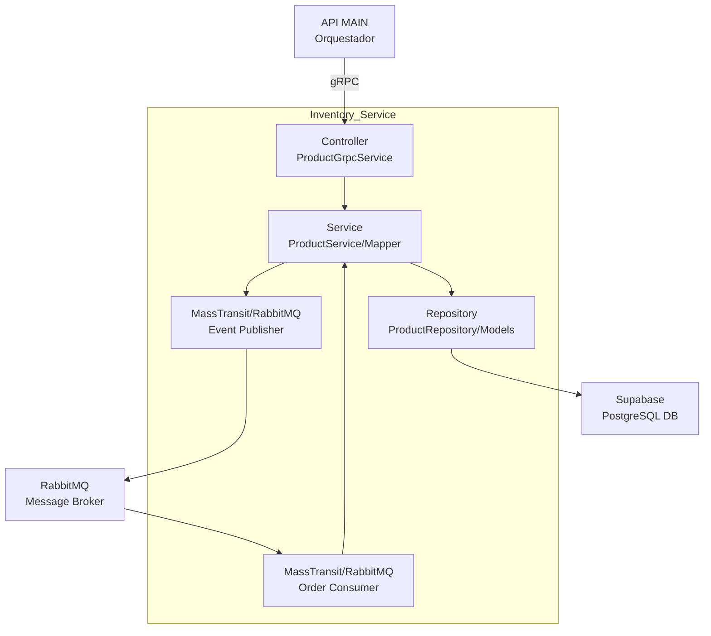

# censudex-inventory-service

Microservicio encargado de la gestión del inventario para los productos de Censudex. Este módulo forma parte de la migración desde un sistema monolitico a una arquitectura de microservicios. Sus funciones principales son: consultar stock en tiempo real, actualizar movimientos de inventario (entradas, salidas, devoluciones), configurar umbrales mínimos, y gestionar alertas de bajo stock.
## Arquitectura y Patrón de Diseño

### Arquitectura del repositorio: MicroServicios

El Inventory Service implementa una Arquitectura de Microservicios por capas (Layered Architecture) , con una única responsabilidad de negocio (Inventario), utilizando su propia base de datos y comunicación asíncrona a través de un Message Broker.

### Patrones de diseño implementados:
1. **Repository Pattern:** Abstracción del acceso a datos a la base de datos PostgreSQL de Supabase.
2. **Data Transfer Object (DTO):** Utilizado para transferir datos de manera estructurada entre capas (Ejemplo: ProductDto, ProductVisualizerDto).
3. **Message Broker (RabbitMQ/MassTransit):** Implementado para comunicación asíncrona. Consume eventos de Orders Service (order.created) para descontar stock y publica eventos de alerta (stock.low, order.failed.stock).

## Tecnologías utilizadas
- **Framework:** ASP.NET Core 9.0
- **Protocolo API:** gRPC (para comunicación con el API Gateway).
- **Base de Datos:** Supabase (PostgreSQL).
- **Mensajería:** MassTransit y RabbitMQ.
- **Control de versiones:** Git con Conventional Commits

## Modelo de Datos
### Entidad Product (Supabase/PostgreSQL)
```
{
  id: Guid, // Identificador único (Primary Key)
  name: string, // Nombre del producto
  category: string, // Categoría del producto
  stock: int, // Stock actual
  is_active: bool, // Indica si el producto está activo
  minimum_stock: int // Umbral mínimo de stock para alertas
}
```

## Supabase (Configuración de Base de Datos)
Para el correcto funcionamiento del servicio de inventario, que utiliza PostgreSQL a través del cliente Supabase/Postgrest, es obligatorio que la tabla de persistencia se configure de la siguiente manera:
* Nombre de la Tabla: La tabla en su base de datos debe llamarse Product.
* Columnas y Atributos: Las columnas deben coincidir exactamente con los atributos definidos en el modelo Product.cs, ya que la librería Supabase las mapea por convención.
  - id (UUID/Guid - Primary Key)
  - name
  - category
  - stock
  - is_active
  - minimum_stock
## Endpoints del Servicio (gRPC Service)

El servicio Inventory se expone a través de gRPC al API Gateway.

| Método | Request | Response | Descripción|
|--------|----------|-------------|-----------|
| `AddProduct` | `AddProductRequest` | `AddProductResponse` | Agrega un nuevo producto al inventario. |
| `GetAllProducts` | `google.protobuf.Empty` | `GetAllProductsResponse` | Consulta la lista completa de productos.|
| `GetProductById` | `GetProductByIdRequest` | `GetProductByIdResponse` | Obtiene el stock y detalles de un producto por ID. |
| `UpdateStock` | `UpdateStockRequest` | `UpdateStockResponse` | Ajusta la cantidad de stock para entradas/salidas. Publica evento ***stock.low*** si es necesario. |
| `SetMinimumStock` | `SetMinimumStockRequest` | `SetMinimumStockResponse` | Configura el umbral mínimo de stock para alertas. |

## Instalación y Configuración

- **.NET 9 SDK:** [Download](https://dotnet.microsoft.com/download/dotnet/9.0)
- **Visual Studio Code** [Download](https://code.visualstudio.com/)
- **Base de Datos Supabase:** Instancia de PostgreSQL (para el repositorio del servicio).

1. **Clonar el repositorio**
    ```bash
    git clone https://github.com/Proyecto-Censudex-2025/censudex-inventory-service.git
    cd <Directorio donde fue clonado>
    ```
2. **Configurar Varibles de Entorno (.env)**
   Crea un archivo '.env' en el directorio del repositorio con las credeciales de Supabase.

   Ejecuta el siguiente comando en la terminal.
   ```bash
    cp .env.example .env
    ```
   Rellena los datos del archivo .env.
   ```env
   SUPABASE_URL=<URL de su proyecto Supabase>
   SUPABASE_API_KEY=<Clave API de servicio Supabase>
    ```
3. **Configurar RabbitMQ:** Asegúrese de que el servidor de RabbitMQ esté corriendo. La configuración por defecto en `Program.cs` usa `localhost` con credenciales `guest`/`guest`.

    **Para levantar la instancia de RabbitMQ (Con Docker Desktop ejecutándose).**

   Ejecuta el siguiente comando en la terminal.
    ```bash
    docker run -d --hostname my-rabbit --name rabbitmq -p 5672:5672 -p 15672:15672 rabbitmq:3-management
    ```
4. **Inicializar la Base de Datos (PostgreSQL)**
    * **Creación de la Tabla:** Antes de ejecutar el proyecto, asegúrese de que la tabla **`Product`** esté creada en su instancia de Supabase (PostgreSQL) con las columnas especificadas en el apartado **Supabase (Configuración de Base de Datos)**.

5. **Instalar Dependencias**
    ```bash
    dotnet restore
    ```

6. **Ejecutar el Proyecto**
    ```bash
    dotnet run --urls http://localhost:7004
    ```
    * El microservicio gRPC estará disponible para el API Gateway en el siguiente endpoint: **`https://localhost:7004`**.
### Ignacio Carvajal, 21.411.819-K

